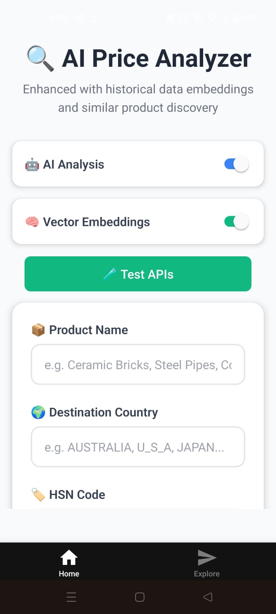
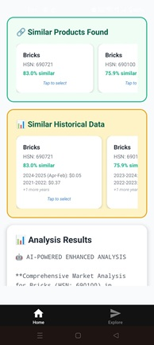

# 🔍 AI Price Analyzer — HSN-Based RAG App

A mobile application powered by **AI and embeddings** that helps users analyze current and historical product pricing across global markets.

---

## 🌐 Live App

👉 [**Launch App**](https://expo.dev/accounts/vaibhavkalvankar/projects/ExpoDemo/builds/4b3e4b43-1a0d-40ea-8a0b-81d8cf8dd2bc)

---

## 🖼️ Screenshots

### 🔹 Landing Page

### 🔹 Historical Data View

### 🔹 AI Analysis Output

---

## 📌 Overview

This app uses **HSN code**, **product name**, and **destination country** to fetch and analyze historical pricing data and provide insights including:

- 📊 **Current selling price trends**
- 🤖 **AI-powered market analysis**
- 🔮 **Predicted price direction**
- 🧠 **Similar product suggestions** using **embeddings**
- 📈 **Tabular view of historical data**

---

## 💡 How It Works

1. **User Input**:  
   Enter HSN code, product name, and destination country.

2. **Data Retrieval**:  
   App fetches available historical price records for that product and country.

3. **Embeddings + RAG**:  
   If enabled, the app uses vector embeddings to find **semantically similar products** with pricing data.

4. **AI/LLM Analysis**:  
   Depending on toggle:
   - Performs **local statistical analysis**, or
   - Sends enriched data to an LLM for deeper context-based price evaluation and predictions.

5. **Visualization**:  
   Results are shown with:
   - Trends
   - Recommendations
   - Similar product cards
   - Historical price table

---

## 🔧 Features

- Toggle between **AI Analysis** and **Local Logic**
- Enable/disable **Embeddings** usage
- Interactive UI with loading indicators and cards
- Tap any similar product to autofill fields and re-analyze
- Built-in **API health test** for backend services

---

## 📱 Target Users

- Exporters and importers
- Market analysts
- Trade consultants
- Business developers

---

## 🧠 Technology Highlights

- **React Native (Expo)**
- Retrieval-Augmented Generation (RAG)
- Vector Embeddings for similarity
- LLM-powered contextual analysis
- Structured presentation of insights

---

## ✍️ Author

Created by [Vaibhav Kalvankar]  
📧 [vaibhavkalvankar97@gmail.com]
